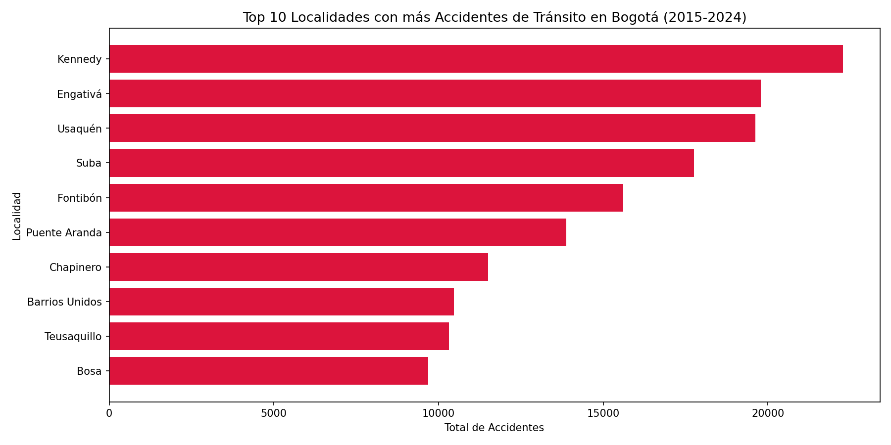
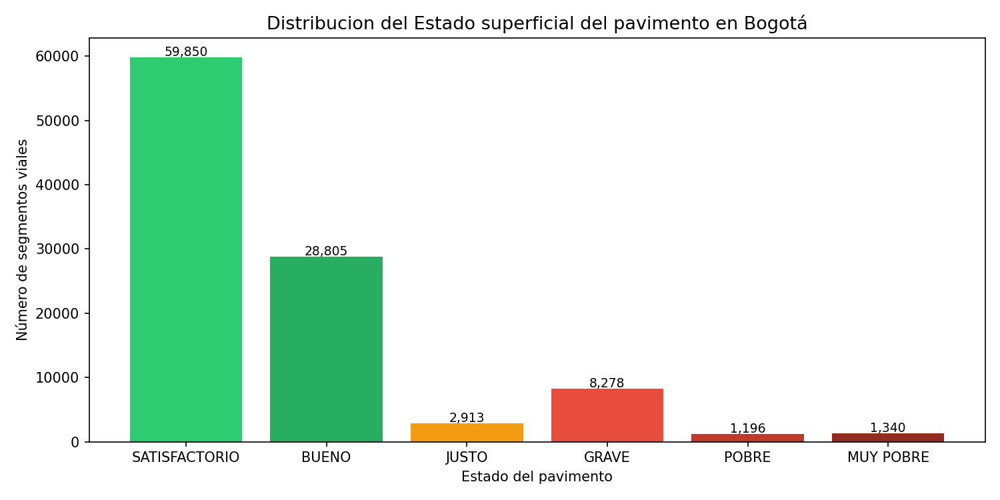
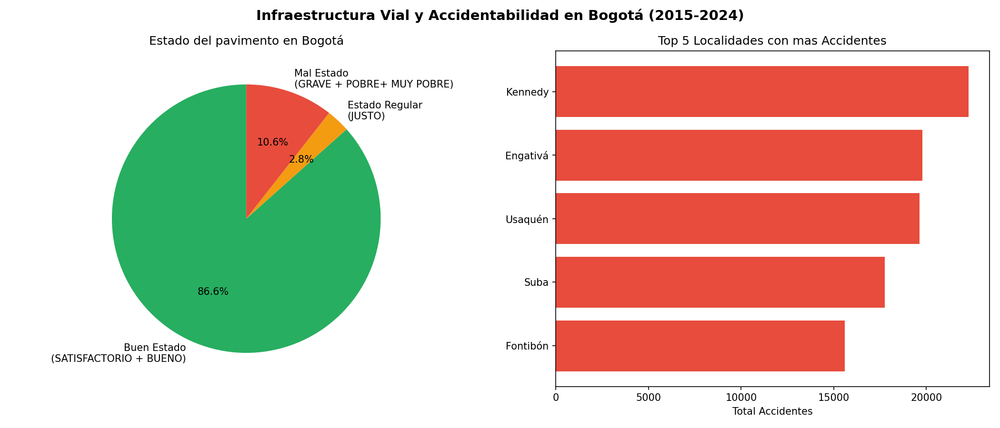

# 🚦 Análisis de Infraestructura Vial y Accidentalidad en Bogotá

## 📋 Descripción
Análisis exploratorio de datos que investiga la relación entre el estado 
del pavimento y la accidentalidad vial en las localidades de Bogotá D.C., 
usando datos oficiales del período 2015-2024.

**Pregunta central:** ¿Las localidades de Bogotá con peor estado de vías tienen más accidentes de tránsito?

---

## 🗂️ Datasets utilizados
| Dataset | Fuente | Registros |
|---|---|---|
| Siniestros Viales Consolidados Bogotá | Secretaría Distrital de Movilidad | 196,152 |
| Estado Superficial del Pavimento (PCI) | IDU - Instituto de Desarrollo Urbano | 103,300 |

---

## 🔧 Herramientas y librerías
- Python 3.11
- pandas
- numpy
- matplotlib
- Jupyter Notebook

---

## 📊 Hallazgos principales
1. **Kennedy, Engativá y Usaquén** concentran el 31% de todos los accidentes de Bogotá
2. El **10.6% de los segmentos viales** están en estado GRAVE, POBRE o MUY POBRE
3. El **86.6% de la malla vial** está en buen estado (BUENO + SATISFACTORIO)
4. La accidentalidad en zonas críticas puede estar más relacionada con 
   factores de tráfico y comportamiento que solo con infraestructura

---

## 📈 Visualizaciones

---

## ⚠️ Limitaciones
El dataset de pavimento no incluye código de localidad directamente,
lo que impide un cruce geográfico exacto. Un análisis más profundo 
requiere georreferenciación de segmentos viales por localidad.

---

## 👤 Autor
**Jeisson Forero** | Ingeniero Civil | Maestría en Data Science  
GitHub: [jforero-ds](https://github.com/jforero-ds)  
Kaggle: [JeissonForeroE](https://www.kaggle.com/JeissonForeroE)
Correo: jeisson.foreroe@gmail.com