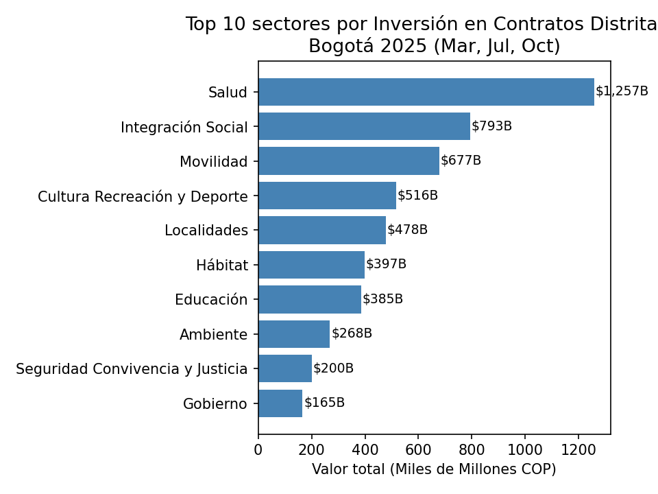
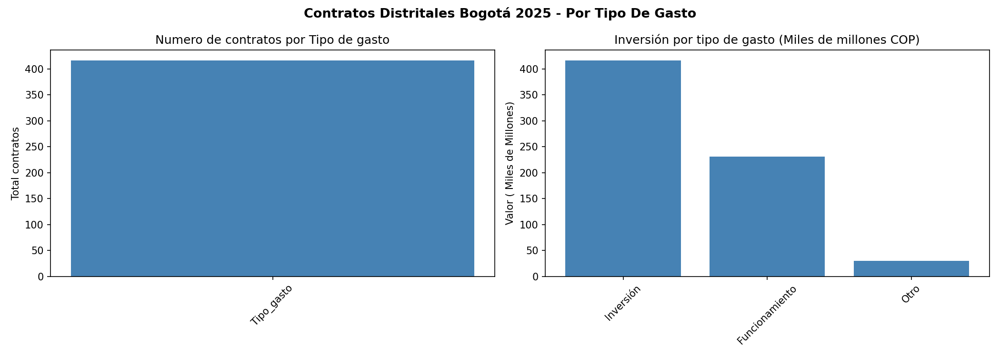

# 📊 Análisis de Contratos Distritales Bogotá 2025

## 📋 Descripción
Análisis exploratorio de los contratos suscritos por las entidades 
distritales de Bogotá durante 2025, identificando qué sectores 
concentran mayor inversión y cuál es la distribución del gasto público.

**Pregunta central:** ¿Qué sectores de la administración distrital 
de Bogotá concentran mayor inversión en contratos durante 2025?

---

## 🗂️ Datasets utilizados
| Dataset | Fuente | Registros |
|---|---|---|
| Contratos Distritales Marzo 2025 | Datos Abiertos Bogotá | 225 |
| Contratos Distritales Julio 2025 | Datos Abiertos Bogotá | 226 |
| Contratos Distritales Octubre 2025 | Datos Abiertos Bogotá | 226 |

---

## 🔧 Herramientas y librerías
- Python 3.11
- pandas
- numpy
- matplotlib
- Jupyter Notebook

---

## 📊 Hallazgos principales
1. **Salud lidera** la inversión con $1.25 billones en solo 37 contratos
2. **Localidades** tiene el mayor número de contratos (137) pero menor valor promedio
3. **Movilidad** ocupa el 3er lugar con $677 mil millones — infraestructura como prioridad
4. El **90%+ del gasto** es Inversión vs Funcionamiento

---

## 📈 Visualizaciones

---

## ⚠️ Limitaciones
Solo se analizaron 3 meses del año. Un análisis completo requiere 
los 12 meses para identificar patrones estacionales y tendencias anuales.

---

## 👤 Autor
**Jeisson Forero** | Ingeniero Civil | Maestría en Data Science  
GitHub: [jforero-ds](https://github.com/jforero-ds)  
Kaggle: [JeissonForeroE](https://www.kaggle.com/JeissonForeroE)  
Email: jeisson.foreroe@gmail.com